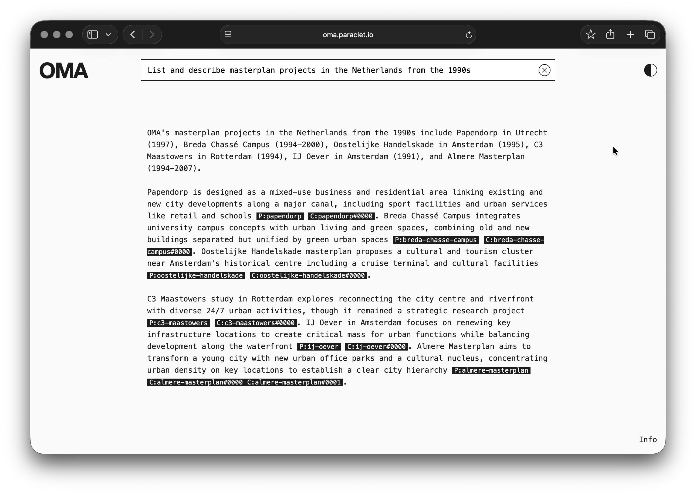

# OMA-RAG

A retrieval-augmented generation system for querying the OMA project archive. The corpus combines structured metadata (location, typology, client, year) with unstructured descriptive text scraped from [oma.com/projects](http://www.oma.com/projects). Every answer is grounded in retrieved source and includes citations.

**Live demo:** [oma.paraclet.io](http://oma.paraclet.io)



---

## Motivation

OMA's project archive is rich but hard to query. Keyword search misses conceptual relationships; browsing doesn't scale. This project shows how a retrieval pipeline combined with query planning can make a domain corpus queryable in natural language, without sacrificing source grounding.

---

## Architecture

### Query Pipeline (online)

```
Query → Planner → Normalizer → Retrieval → Fusion → Synthesizer → Validator → Answer
```

- **Planner** (`gpt-4o-mini`): Interprets the query and produces a structured search plan
- **Normalizer**: Expands filter values using a domain vocabulary and alias map
- **Retrieval** (`text-embedding-3-small`): Runs parallel structured field queries (metadata filters) and kNN embedding searches against OpenSearch
- **Fusion**: Merges and re-ranks results from both retrieval paths
- **Synthesizer** (`gpt-4.1-mini`): Streams a cited answer grounded in retrieved chunks
- **Validator**: Post-processes and validates the final response

### Ingestion Pipeline (offline)

```
Raw HTML → parser.py → extract_specs.py → chunker.py → embedder.py → streamer.py → OpenSearch
```

Transforms raw HTML project pages into indexed, searchable chunks. Each step produces an artifact that can be inspected and corrected before the next step runs. See `ingestion/README.md` for details.

---

## Directory Structure

```
oma-rag/
├── ingestion/        # Ingestion pipeline (parser → ... → OpenSearch)
├── backend/          # FastAPI backend (api.py, planner.py, synthesis.py, ...)
├── frontend/         # Next.js 15 frontend
└── deploy/
    ├── docker-compose.yml  # Local OpenSearch + Dashboards
    └── seed.sh             # Load ingestion artifacts into local OpenSearch
```

---

## Prerequisites

- Python 3.11+
- Node.js 18+
- Docker
- OpenAI API key

---

## Quick Start

### 1. Install dependencies

```bash
pip install -r backend/requirements.txt
cd frontend && npm install && cd ..
```

### 2. Download pre-built artifacts

```bash
curl -L https://paraclet.s3.eu-central-1.amazonaws.com/artifacts.zip -o artifacts.zip
unzip artifacts.zip -d ingestion/artifacts
```

### 3. Configure environment

```bash
cp .env.example .env
# Set OPENAI_API_KEY
```

### 4. Start OpenSearch

```bash
make local-infra
# OpenSearch: http://localhost:9200
# Dashboards: http://localhost:5601
```

### 5. Seed and run

```bash
make seed
make dev-backend # http://localhost:8000
make dev-frontend # http://localhost:3000
```

---

## Deployment

The live demo runs on AWS (OpenSearch Service, EC2 backend, Vercel frontend). Deployment configuration is kept private — see the architecture above for the component breakdown.

Any equivalent stack works: hosted OpenSearch or Elasticsearch for the index, any Python host for the backend, Vercel or Netlify for the frontend.

Set `API_URL` in the frontend environment to point at the deployed backend.

---

## Limitations

- **Corpus scope**: The index covers OMA's 580 project pages. Lectures, publications, and news from oma.com are not included. Queries about non-project content will return no evidence and the system will say so explicitly.

- **Out-of-domain queries**: The system does not restrict input to architectural topics. Off-topic queries (translations, general knowledge, calculations) may return an answer drawn from the LLM's general knowledge rather than the corpus. The response will flag when no grounded evidence was found.

- **LLM dependency**: If the OpenAI API is unreachable the system will fail. There is no offline fallback for synthesis or planning.